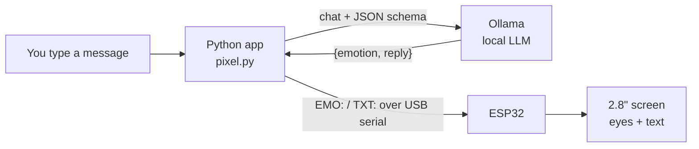

# Pixel 🤖 — Local AI Desk Assistant on ESP32

Pixel is an offline AI desk companion. You chat with it on your laptop, a **local LLM running through Ollama** decides what to say and how it feels, and an **ESP32 with a 2.8" screen** shows Pixel's face: animated eyes that change shape and color with its emotion, plus the reply text.

No cloud APIs, no subscription, and your conversations never leave your machine.

<!-- Add a photo or GIF of Pixel here, e.g.:  -->

## Features

- 🧠 **Runs fully offline** with a local LLM (default: `llama3.2:3b` via Ollama)
- 🎭 **Six emotions**, each with its own eye shape and color: happy, sad, angry, surprised, thinking, neutral
- 📐 **Structured output**: the LLM is constrained to a JSON schema and validated with Pydantic, so the hardware always receives valid commands
- 💬 **Conversation memory** within a session
- 👀 **Idle animation**: Pixel blinks on its own and shows "thinking" eyes while the model works
- 🔌 **Custom serial protocol** between PC and ESP32

## Architecture



1. You type a message in the terminal.
2. `pixel.py` sends the conversation to Ollama along with a **JSON schema** describing the required answer: an `emotion` (one of six fixed values) and a `reply`.
3. Ollama uses **constrained decoding**, so the model can only produce output matching that schema.
4. Pydantic **validates** the JSON. If anything is wrong, Pixel falls back to a neutral face instead of crashing.
5. The app sends two commands to the ESP32, which redraws the eyes and prints the reply.

### Serial protocol

USB serial at 115200 baud. One command per line, ending in `\n`:

| Command | Example | Effect |
|---|---|---|
| `EMO:<emotion>` | `EMO:happy` | Changes eye shape and color |
| `TXT:<text>` | `TXT:Hello there!` | Shows reply text under the eyes |

The newline marks where each message ends (framing), and the prefix tells the ESP32 what kind of message it is.

### Emotions

| Emotion | Eyes | Color |
|---|---|---|
| happy | Smiling crescents | Yellow |
| sad | Outer corners droop | Blue |
| angry | Inner corners slant down | Red |
| surprised | Wide round eyes | Pink |
| thinking | Smaller eyes looking up | Purple |
| neutral | Tall rounded eyes | Cyan |

## Hardware

- **2.8" ESP32 display board** (ESP32-32E / WROOM-32E, ILI9341, 320×240), "Cheap Yellow Display" style
- USB data cable
- A PC or laptop that can run Ollama (developed on an Intel i9 laptop with an RTX 3050 Ti, 4 GB VRAM)

| Display signal | GPIO |
|---|---|
| SCK | 14 |
| MISO | 12 |
| MOSI | 13 |
| CS | 15 |
| DC | 2 |
| Backlight | 21 |

## Setup

### 1. Ollama and the model

Install [Ollama](https://ollama.com), then:

```bash
ollama pull llama3.2:3b
```

### 2. ESP32

1. Install [Arduino IDE 2](https://www.arduino.cc/en/software).
2. **Boards Manager** → install **esp32 by Espressif Systems**.
3. **Library Manager** → install **Adafruit ILI9341** (accept dependencies).
4. Open `esp32/pixel_face/pixel_face.ino`, select **ESP32 Dev Module** and your port, and click **Upload**.
5. Close Arduino IDE afterwards so the serial port is free.

### 3. Python

Requires Python 3.9 or newer.

```bash
python -m venv .venv
# Windows (PowerShell):
.venv\Scripts\Activate.ps1
# macOS / Linux:
source .venv/bin/activate

pip install -r requirements.txt
```

## Usage

```bash
cd python
python pixel.py
```

Try messages that trigger different emotions, like *"I just got my ESP32 working!"* or *"My code has 50 errors."* Type `quit` to exit.

To just chat with the model in the terminal (no hardware needed):

```bash
python chat.py
```

### Configuration

Defaults can be changed with environment variables:

| Variable | Default | Purpose |
|---|---|---|
| `PIXEL_MODEL` | `llama3.2:3b` | Ollama model to use |
| `PIXEL_PORT` | `COM7` | ESP32 serial port (e.g. `/dev/ttyUSB0` on Linux) |

```powershell
# PowerShell example
$env:PIXEL_PORT = "COM5"; python pixel.py
```

## Performance notes

On a 4 GB GPU, `llama3.2:3b` uses about 3.1 GB including the KV cache, so Ollama may split it between CPU and GPU (check with `ollama ps`). Options to speed it up:

- Enable flash attention and a smaller KV cache: set `OLLAMA_FLASH_ATTENTION=1` and `OLLAMA_KV_CACHE_TYPE=q8_0`, then restart Ollama.
- Use a smaller model such as `llama3.2:1b` (faster, less capable).
- Measure speed with `ollama run <model> --verbose` and compare the eval rate.

## Troubleshooting

| Problem | Fix |
|---|---|
| `could not open port ... Access is denied` | Another program (Arduino IDE / Serial Monitor) is using the port. Close it, unplug and replug the ESP32. |
| Upload fails: port busy | Stop `pixel.py` before uploading new ESP32 code. |
| Screen stays white/black | Your board may use different pins; update the `#define`s in the sketch. |
| Pixel replies slowly | See **Performance notes** above. |
| Emojis missing on screen | Expected: the built-in font is ASCII-only, so non-ASCII characters are removed. |

## Project structure

```
pixel-ai-desk-assistant/
├── esp32/
│   └── pixel_face/
│       └── pixel_face.ino     # face renderer + serial command parser
├── python/
│   ├── pixel.py               # main app: LLM + structured output + serial
│   └── chat.py                # phase 1: minimal terminal chat
├── docs/
│   └── LEARNING_LOG.md        # concepts learned while building
├── requirements.txt
├── LICENSE
└── README.md
```

## Roadmap

- [x] **Phase 1** — Chat with a local LLM from Python
- [x] **Phase 2** — Structured JSON output and emotion display on the ESP32
- [ ] **Phase 3** — Tool calling: Pixel starts timers and triggers animations on its own
- [ ] **Phase 4** — Voice input (Whisper) and spoken replies (text-to-speech)
- [ ] **Phase 5** — Wi-Fi connection instead of USB
- [ ] **Phase 6** — Long-term memory with embeddings and RAG
- [ ] **Phase 7** — Benchmarks, demo video, and polish

## What I learned

Building Pixel covered embedded programming, serial protocols, local LLM deployment, GPU memory trade-offs, and structured LLM output. See [docs/LEARNING_LOG.md](docs/LEARNING_LOG.md) for the full breakdown.

## Built with

- [Ollama](https://ollama.com) — local LLM runtime
- [Pydantic](https://docs.pydantic.dev) — schema definition and validation
- [pySerial](https://pyserial.readthedocs.io) — USB serial communication
- [Adafruit ILI9341](https://github.com/adafruit/Adafruit_ILI9341) & [Adafruit GFX](https://github.com/adafruit/Adafruit-GFX-Library) — display drawing

## License

[MIT](LICENSE)
